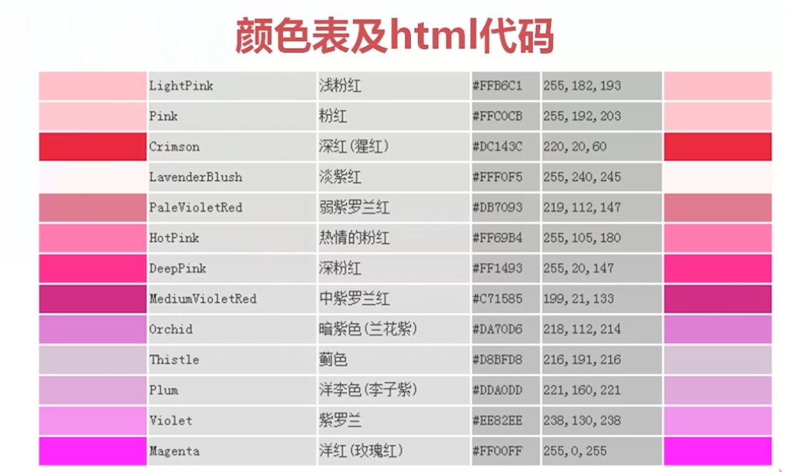

#  外部样式

- 外部样式就是新建一个文档，里面全写css，然后再通过link插入到html代码中

**作用** 使网页的表示层与结构层彻底分离

**示例** 将背景设置，修改为外部样式表

```html
<link rel="stylesheet" type="text/css" href="index.css">
```

**小贴士** 除了link进行外部样式表的连接，还有其他方法哦

- ```type=“text\css```可以省略

- ```html
  <link 定义文档与外部资源的关系
  ```

- ```html
  rel="stylesheet" rel是relationship的英文缩写，也就是“关系”
  ```

- ```html
  type="text/css" 文件类型
  ```

- ```html
  href="index.css" 引用的具体文件
  ```


# 文本类样式



**使用颜色**

- 尽量找一些颜色代码表来使用

# 文本样式

- 对其方式、文本修饰、文本转换、文本缩进

**作用**  美化、修饰页面的文字部分相关内容

**示例**  ``` .lineHight{;ome-height:60px;}```

**小贴士** 更重要的是要了解样式实现的效果

# 文本样式

<table>
    <tr bgcolor="red">
        <td></td>
        <td>属性</td>
        <td>属性值</td>
        <td>作用</td>
    </tr>
    <tr>
        <td>1</td>
        <td>color</td>
        <td>表示颜色的内容</td>
        <td>设置文本颜色</td>
    </tr>
    <tr>
        <td>2</td>
        <td>direction</td>
        <td>ltr、rtl
        <td>文本的方向/书写方向</td>
    </tr>
    <tr>
        <td>3</td>
        <td>letter-spacing</td>
        <td>npx（注：n可以是负数）</td>
        <td>字符间距</td>
    </tr>
    <tr>
        <td>4</td>
        <td>line-height</td>
        <td>npx</td>
        <td>行高</td>
    </tr>
    <tr>
        <td>5</td>
        <td>text-align</td>
        <td>left、right、center、justify</td>
        <td>文本对齐方式</td>
    </tr>
</table>


```html
p{
    background-color: #FFB6C1;
    font-size: 20px;
    /*direction: rtl;*/ /*右对齐*//*只对阿拉伯语和阿拉伯数字有效，不然就是右边对齐*/
    line-height: 20px;/*行高*/
    text-align: center; /*居中*/
    letter-spacing: 20px;/*字间距*/
}
```

# 文本样式

|      | 属性            | 属性值                                  | 作用                         |
| ---- | --------------- | --------------------------------------- | ---------------------------- |
| 6    | text-decoration | none、underline、overline、line_through | 文本的修饰：<br>例如：下划线 |
| 7    | text-shadow     | h-shadow v-shadow blur color            | 文本设置阴影                 |
| 8    | text-transform  | none、capitalize、uppercase、lowercase  | 改变字母大小写               |
| 9    | text-indent     | npx、nem                                | 首行缩进                     |

```html
.p2{
    text-shadow: 5px 5px 5px red; 文本阴影
    text-transform: uppercase;文本大小写
    text-indent: 2em;首行缩进
}
```

# 字体样式

- font-系列：font-style、font-family等

**作用** 定义文本的字体系列、大小、加粗、风格（如斜体）和变形（如小型大写字母）...

**示例**  ``` .lineHeight{line-height:30px;font-size:12px;font-style:italic}```

**小贴士** 更重要的是要了解样式实现的效果

|      | 属性        | 属性值                  | 作用         |
| ---- | ----------- | ----------------------- | ------------ |
| 1    | font-family | 隶书、仿宋、楷体等字体  | 设置字体     |
| 2    | font-style  | normal、italic、oblique | 规定斜体文本 |
| 3    | font-weight | normal、bold、100-900   | 文本的粗细   |
| 4    | font-size   | npx                     | 字体大小     |

```html
.p3{
    font-style: italic;
    font-weight: bold;
    font-size: 30px;
    font-family: 隶书;
}
```

# 字体类样式小结

- 斜体
- 加粗
- 大小
- 字体类型

